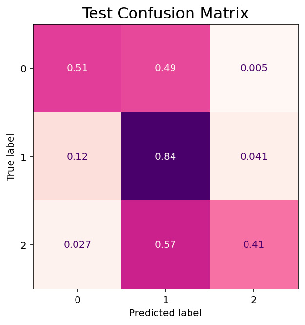

# Text-Based Classification of Climbing Routes
### General Assembly Capstone Project 
### by [Ana Lincoln](https://www.linkedin.com/in/ana-lincoln/)
Originating in the early 20th century, the sport of outdoor rock climbing has exploded in the 21st, fueled especially in the last few years by the necessity of socializing outdoors rather than in homes or gyms. Paper guidebooks were the original way for climbers to get beta, aka descriptions of the locations and difficulty of climbing routes; but in the last 20 years, the beta website Mountain Project has become more and more popular, crowd-sourcing data for thousands of routes. This gives us access to climbing data in a way that was never possible before. Of the data available, all of it is either free-form text or categorical, which led me to the primary question of the dataset: Can the text features be used to predict the difficulty of the route? 

## Problem Statement
Create a classification model with an accuracy and mean absolute error over the baseline that can be used to predict the grade of a climbing route based on the description.

## Dataset
For this initial exploration I chose the most recent scrape of US climbing routes from [OpenBeta](https://openbeta.io/), a project that aims to make climbing beta open source and easily accessible. The project was created after [Mountain Project](https://www.mountainproject.com/), the most popular website for crowdsourced climbing beta, was sold to an owner much less keen on sharing the data they had collected. The dataset I used, from [this OpenBeta branch](https://github.com/OpenBeta/climbing-data/tree/next), contains 127,000 roped climbing routes that had been recently scraped from Mountain Project. From the given features, I created the following for modeling:

| Feature                  | Type | Description                                                                                   |
|--------------------------|------|-----------------------------------------------------------------------------------------------|
| grade_reduced            | int  | The plain difficulty rating of the YDS grade (only 5th class routes were included)            |
| lemmatized_text_combined | str  | The combination of the three main text features, with various cleaned and lemmatized versions |
| type                     | bit  | Actually 7 columns, each a one-hot encoded representation of the climb type of the route      |
| year_established         | int  | The year the route was established, extracted from the text of the FA                         |

## Implementation
In exploring this problem, I tried two different modeling approaches. The main modeling approach was using Facebook's fastText supervised model, which is similar to word2vec with a hierarchical softmax output. For transfer learning, I tried a BERT pre-trained model loaded from HuggingFace's transformers. Each of these models required slightly different pre-processing, but they were both run on the version of the combined text that had stop words removed and was lemmatized using spaCy. 

Baseline models achieved around 33% accuracy, and unfortunately, an array of extra data processing steps and model iterations yielded no better results. These steps included:
- Further stop word removal
- Corpus-specific spelling corrections
- Feature addition

The primary challenge of this dataset is deep class imbalances. My reduction of the 5th class of the YDS system leads to 16 possible grades, 5.0-5.15. 

| Grade | Num Rows | % Dataset |
|-------|----------|-----------|
| 5.0   | 166      | 0.1       |
| 5.1   | 118      | 0.09      |
| 5.2   | 396      | 0.3       |
| 5.3   | 731      | 0.5       |
| 5.4   | 1,722    | 1.3       |
| 5.5   | 2,538    | 1.9       |
| 5.6   | 5,424    | 4.2       |
| 5.7   | 9,953    | 7.8       |
| 5.8   | 13,715   | 10.7      |
| 5.9   | 16,556   | 13.03     |
| 5.10  | 33,577   | 26.4      |
| 5.11  | 24,114   | 18.9      |
| 5.12  | 13,829   | 10.8      |
| 5.13  | 3,710    | 2.9       |
| 5.14  | 451      | 0.3       |
| 5.15  | 8        | 0.006     |

Any given iteration of the models could only predict 5-10% accuracy above the null model, with around 4% improvement in the MAE. Attempts to address class imbalances using random under and over sampling actually showed severe reduction in model performance.

### Further Reduction of Classes
Here is our best test confusion matrix from the models with the full number of classes:

You can see that the predictions cluster around 7, 10, and 12, clusters that were also seen during EDA. After a few iterations of class reduction, our final reduced classes are:

| Group | Grade     | % Dataset |
|-------|-----------|-----------|
| 0     | 5.0-5.8   | 27%       |
| 1     | 5.9-5.11  | 58%       |
| 2     | 5.12-5.15 | 14%       |

This grouping still sees a massive class imbalance, but by grouping the data the way that it was clustering, we saw a 10% gain in accuracy from the null, and a 20% reduction in the MAE from the grouped null model.

The model still heavily over-predicts the majority class, but this grouping shows there are some discernable differences between the groups.

## Conclusion
This dataset proved to be far more tricky to work with than anticipated, especially the deep class imbalances. The intuition I had going into it was that manipulation of the text itself would have noticeable positive effects on the modeling outcomes, but the variety of cleaning methods I tried had essentially no effect. Same for addition of features from other columns within the dataset. The only noteworthy change we saw was when the number of classes was greatly reduced, and this improvement for the most part was an artifact of decreasing the range of potential error distance. The only exception is the final grouping, in which we reduced to 3 groups: easy, intermediate, and difficult. These groupings played to the strength of the model, while also highlighting potential clustering we saw during EDA. 

Ultimately, what this process has shown us is that there is likely no significant difference in the way that routes of different grades are described. However, further methods should be explored.

## Future Work
Primary to the next steps should be the use of document vectors to explore document similarity, using doc2vec, spaCy, or a similar document embedding technique. These vectors can be used for further EDA, and also for more robust resampling techniques. Given the class imbalances, under sampling of the majority classes according to vector similarity or by clustering is likely the only way forward to potentially unlock a reliable classification model.

Ensembling is a second key future approach to this problem. Reduction of classes showed that the models performed better when we narrowed their predictive scope, so having a model that first classifies by group and then subclassifies into more specific grade may be more effective, as there will be less noise from other classes for the subclassifying model to sift through. A caution toward that approach is that so many of the classes showed high similarity during EDA and modeling, so even an ensemble method may not fully solve this problem.

Finally, different insights may be held in this dataset. Rather than focusing on the relationship of the text features and the grade, the relationship between the text features and the type may be more prominent. Plenty of work can also be done looking into the details of the first ascent field and the relationships between the areas and the other feature. This analysis was a good foray into just one slice of this dataset, but there is plenty of complexity yet to explore.